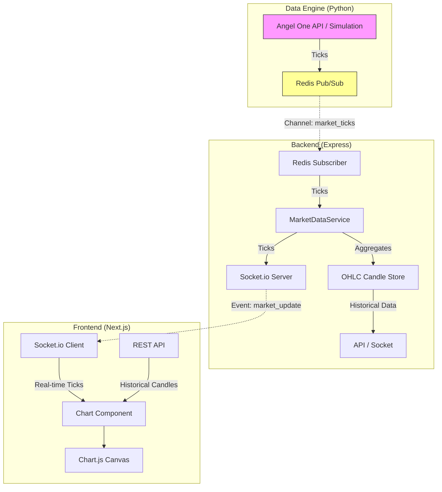

# Adapted Real-Time Charting Guide for Paper Trading Platform

This guide is adapted for the current **Paper Trading** project structure, leveraging the existing **Python Data Engine**, **Express Backend**, and **Next.js Frontend**.

## Architecture Overview



## Prerequisites & Setup

### 1. Frontend Dependencies (Next.js)
Install the necessary charting libraries in `frontend-nextjs`:

```bash
cd frontend-nextjs
npm install chart.js react-chartjs-2 chartjs-adapter-luxon luxon chartjs-chart-financial
# Note: chartjs-chart-financial is needed for Candlestick charts
```

### 2. Backend Dependencies (Express)
Ensure `ta.js` or similar is available if you plan to do server-side indicator calculation (as per the original guide), though client-side calculation is often sufficient for basic indicators.

```bash
cd backend-express
npm install indicators # Optional, for server-side technical indicators
```

---

## Phase 1: Data Engine (Python)
**Status:** ✅ Mostly Complete.

The `data-engine` currently publishes simulated or live ticks to Redis channel `market_ticks`.
- Ensure `market_simulator.py` publishes JSON with: `{ symbol, price, volume, timestamp }`.

No major changes needed here unless you want to aggregate 1-minute bars in Python. For now, we'll stream ticks and aggregate in the backend.

---

## Phase 2: Backend Implementation (Express)

### Step 2.1: Enhance MarketDataService
Files to modify: `backend-express/src/services/MarketDataService.ts`

Goal:
1.  Listen to `market_ticks`.
2.  Aggregate ticks into 1-minute candles (OHLC).
3.  Store candles (In-Memory for now, or MongoDB).
4.  Serve historical candles via API.

**Implementation Plan:**

1.  **Update Interface**:
    ```typescript
    export interface ICandle {
        x: number; // Timestamp (ms)
        o: number; // Open
        h: number; // High
        l: number; // Low
        c: number; // Close
        v: number; // Volume
    }
    ```

2.  **Aggregation Logic**:
    Add a method `processTick(tick: IMarketData)` to `MarketDataService`:
    - Determine current minute timestamp (floor to nearest minute).
    - If new minute, close previous candle and start new one.
    - If same minute, update High/Low/Close/Volume of current candle.

3.  **Historical API**:
    Add endpoint `GET /api/market/history/:symbol?timeframe=1m` in `marketRoutes`.

### Step 2.2: Update Socket Events
In `src/server.ts`:
- Ensure `io.emit('market_update', tick)` is sending the raw tick for immediate price updates.
- Optionally emit `io.emit('candle_update', candle)` when a candle closes or updates.

---

## Phase 3: Frontend Implementation (Next.js)

### Step 3.1: Create Chart Component
Create `frontend-nextjs/components/RealTimeChart.tsx`.

**Key Features:**
- Use `"use client"` directive.
- Initialize `Chart.js` with `Financial` controller (Candlestick).
- Connect to Socket.io (`useContext` or global socket).
- Fetch historical data on mount.
- Update chart buffer on new tick/candle.

**Code Skeleton:**

```tsx
"use client";
import React, { useEffect, useRef, useState } from 'react';
import {
  Chart as ChartJS,
  CategoryScale,
  LinearScale,
  TimeScale,
  Tooltip,
  Legend
} from 'chart.js';
import { CandlestickController, CandlestickElement } from 'chartjs-chart-financial';
import 'chartjs-adapter-luxon';
import { Chart } from 'react-chartjs-2';
import { io } from 'socket.io-client';

// Register Chart.js components
ChartJS.register(
  CategoryScale,
  LinearScale,
  TimeScale,
  CandlestickController,
  CandlestickElement,
  Tooltip,
  Legend
);

export default function RealTimeChart({ symbol }) {
    const [data, setData] = useState<any[]>([]); // OHLC Data
    const socketRef = useRef<any>(null);
    const chartRef = useRef<any>(null);

    useEffect(() => {
        // 1. Fetch Historical Data
        fetch(\`\${process.env.NEXT_PUBLIC_API_URL}/api/market/history/\${symbol}\`)
            .then(res => res.json())
            .then(history => setData(history));

        // 2. Setup Socket
        socketRef.current = io(process.env.NEXT_PUBLIC_SOCKET_URL || 'http://localhost:4000');
        
        socketRef.current.on('market_update', (tick: any) => {
            if (tick.symbol !== symbol) return;

            // Logic to update the latest candle or append new tick
            updateCandleData(tick);
        });

        return () => socketRef.current.disconnect();
    }, [symbol]);

    const updateCandleData = (tick) => {
       // Aggregation logic on client side for immediate feedback
       // ...
    };

    // Render Logic ...
    return <Chart type="candlestick" data={...} options={...} />;
}
```

---

## Phase 4: Technical Indicators
**Strategy:** Calculate on Frontend (easiest for interactivity) or Backend.

**Frontend Approach:**
1.  Use library `technicalindicators` (npm install technicalindicators).
2.  Pass the `close` prices array to `SMA.calculate({period: 20, values: closes})`.
3.  Add the result as a Line dataset to the Chart.js data object.

## Implementation Checklist for `Paper_Trading`

- [ ] **Data Engine**: Verify tick format matches backend expectation.
- [ ] **Backend**:
    - [ ] Install types/deps for aggregation.
    - [ ] Implement `MarketDataService.processTick` for OHLC.
    - [ ] Create endpoint `GET /api/market/history/:symbol`.
- [ ] **Frontend**:
    - [ ] Install `chart.js`, `react-chartjs-2`, `chartjs-chart-financial`.
    - [ ] Create `components/charts/CandlestickChart.tsx`.
    - [ ] Create page `app/dashboard/trade/[symbol]/page.tsx` integrating the chart.
